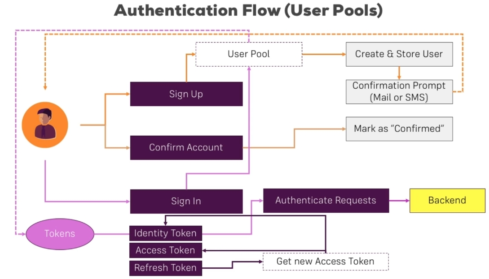

# Cognito

[Cognito](https://aws.amazon.com/cognito/) es un servicio de AWS que provee de
forma sencilla todo el tema de autenticación. Tiene dos formas de usarse:

- User Pools: Se utiliza cuando la aplicación maneja personalmente autentica a
  los usuarios dentro de su aplicación.
- Federated Idendities: Se utiliza cuando se usa autenticación proveniente de
  3ros, como lo son Google, Facebook, Github y demás.

Cognito has a lot of SDKs to be able to be used on a variety of projects:

- [iOS and Android SDK](https://docs.aws.amazon.com/cognito/latest/developerguide/cognito-integrate-apps.html)
- [JS Based Apps](https://github.com/aws-amplify/amplify-js/tree/master/packages/amazon-cognito-identity-js)

Para acceder al id usuario de cognito puedes usar la siguiente variable:

```json
{
  "userId": "$context.authorizer.claims.sub"
}
```

## Flujo de autenticación


