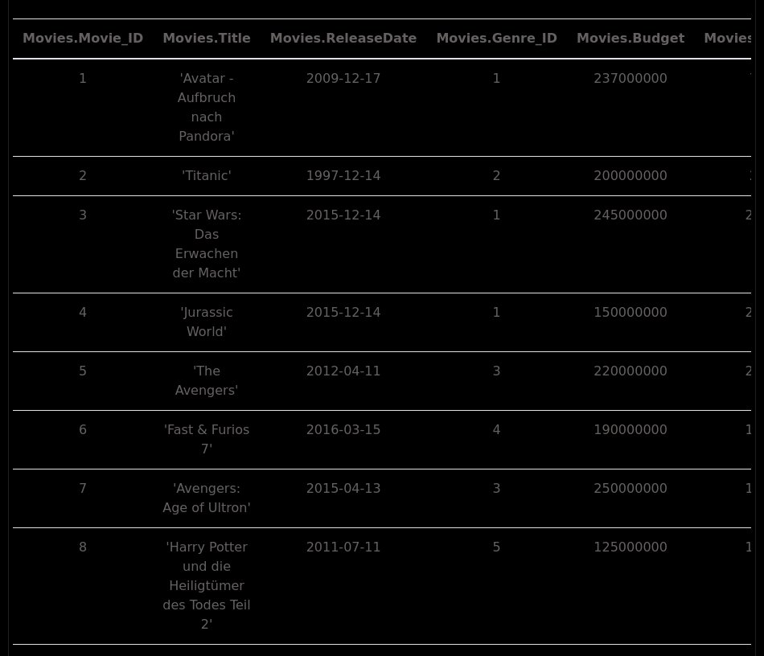
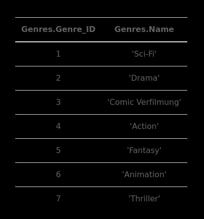
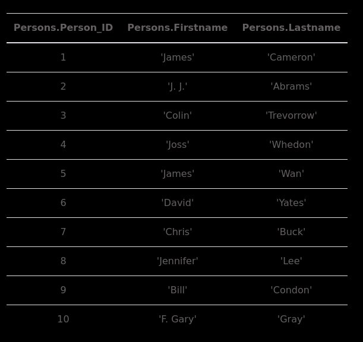
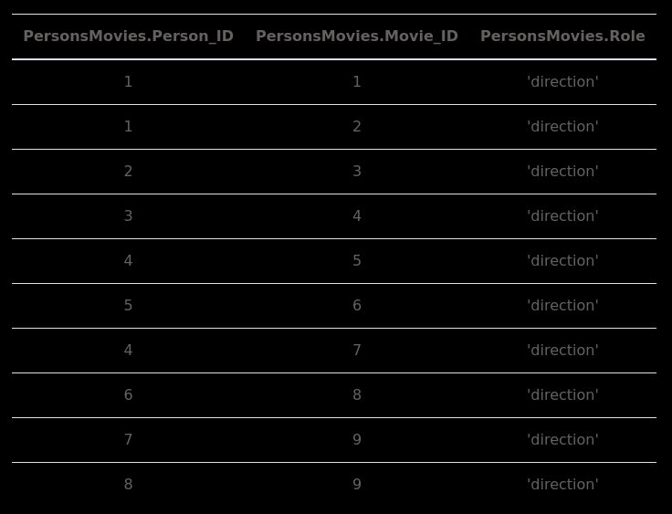
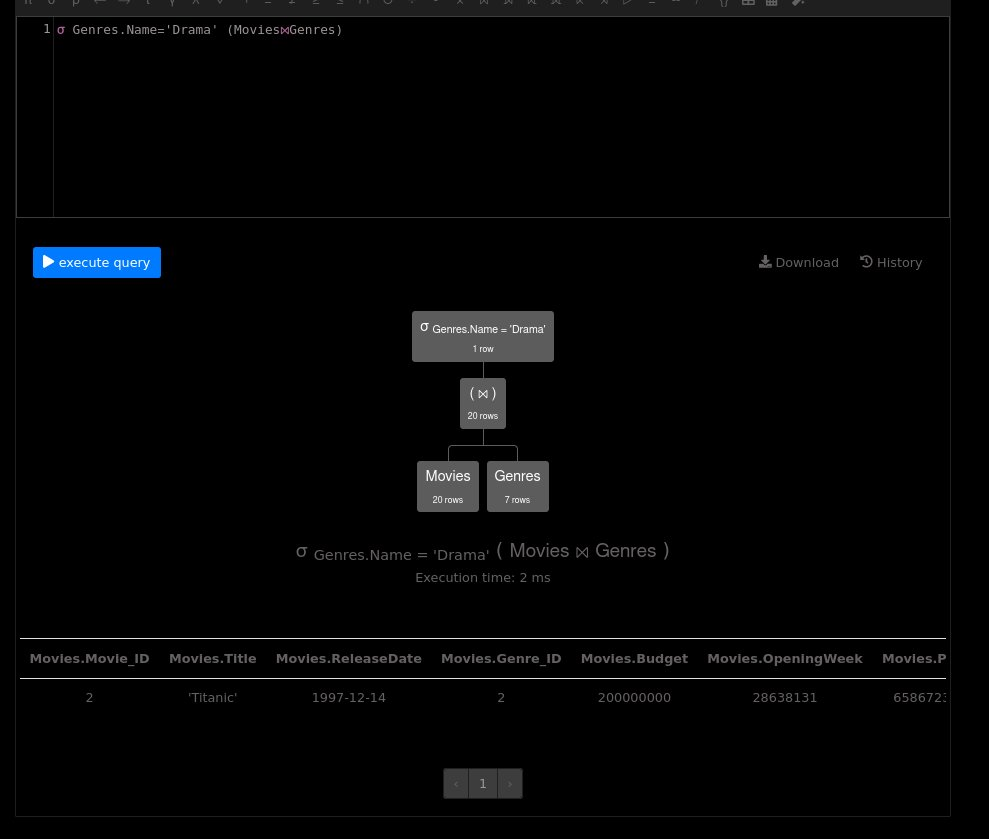
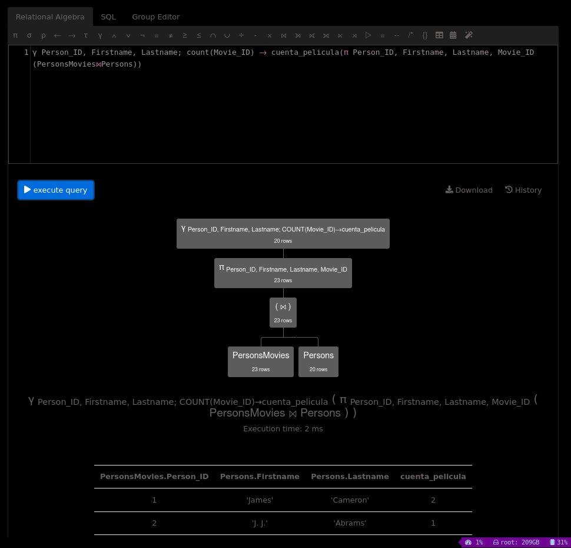
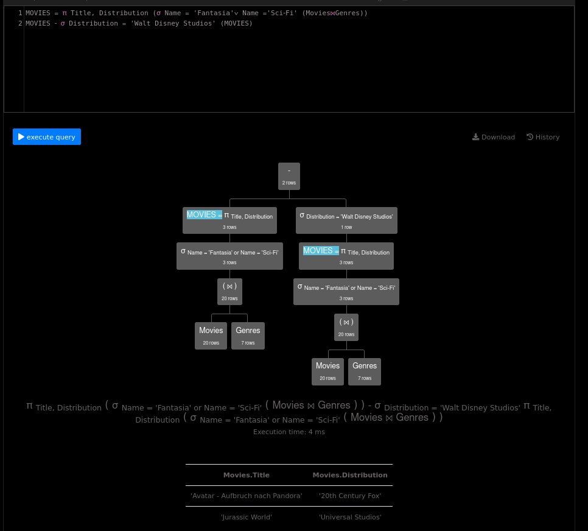
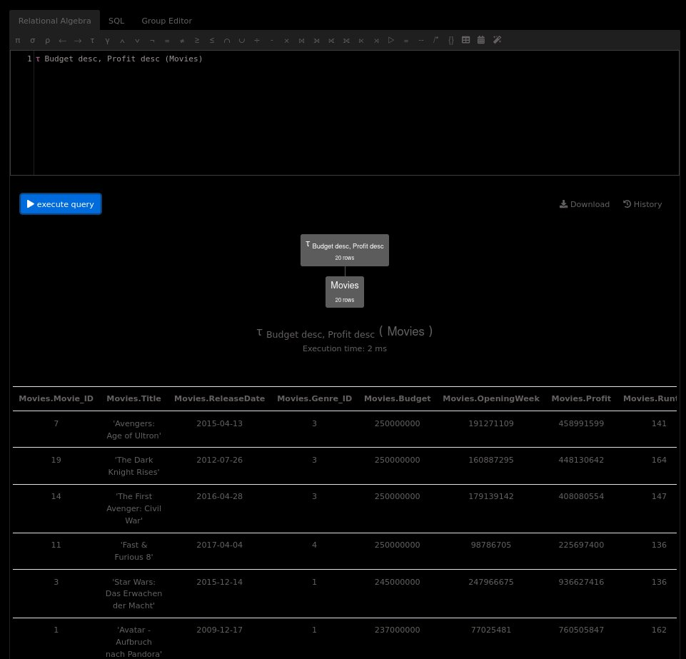

# Lab 8 - Álgebra Relacional
## Ejercicio 1
Considere un modelo relacional con las siguientes cuatro relaciones:

```
Producto (fabricante, modelo, tipo)
PC (modelo, velocidad, ram, disco, precio)
Laptop (modelo, velocidad, ram, disco, pantalla, precio)
Impresora (modelo, color, tipo, precio)
```

La relación Producto consigna el fabricante, modelo y tipo (PC, laptop o impresora) de varios productos, y las demás relaciones almacenan información específica sobre cada producto.
Escriba expresiones en algebra relacional para contestar lo siguiente:

a) Liste los modelos de PC que tengan una velocidad de al menos 3.00
$$
\pi_{modelo}(\sigma_{velocidad\gt 3.00}(PC))
$$

De ahora en adelante usaré la siguiente sintaxis, el problema a se puede traducir así:

$$
\begin{align}
& PC \\
|& \sigma_{velocidad\gt 3.00}\\
|& \pi_{modelo}
\end{align}
$$

b) Liste los fabricantes que producen laptops con un disco duro de al menos 100GB
$$
\begin{align}
productos\_laptops =& Producto\\
|&\sigma_{tipo="laptop"}\\
 Laptop\bowtie productos\_laptops&\\
|& \sigma_{disco\gt 100GB}\\
|& \pi_{fabricante}
\end{align}
$$

c) Liste los modelos y precios de todos los productos de cualquier tipo fabricados por el fabricante B.
$$
\begin{align}
productos\_b=Producto\\
|&\sigma_{fabricante="B"}\\
laptops=productos\_b\bowtie Laptop\\
|&\pi_{modelo, precio}\\
impresoras=productos\_b\bowtie Impresora\\
|&\pi_{modelo, precio}\\
pcs=\rho_{pb}(productos\_b)\bowtie_{pb.modelo=PC.modelo} PC\\
|&\pi_{modelo, precio}\\
laptops\cup impresoras\cup pcs\\
\end{align}
$$

d) Liste los modelos de todas las impresoras laser
$$
\begin{align}
Impresora\\
|&\sigma_{tipo="laser"}\\
|&\pi_{modelo}
\end{align}
$$

e) Liste los fabricantes que producen Laptops pero no PCs
$$
\begin{align}
pcs=Producto\\
|&\sigma_{tipo="PC"}\\
|&\pi_{fabricante}\\
general=Producto\\
|&\pi_{fabricante}\\
general - pcs
\end{align}
$$

f) Liste el tamaño de los discos duros que se encuentren en por lo menos dos PCs
$$
\begin{align}\\
\rho_{pc1}(PC)\bowtie_{pc1.disco == pc2.disco\ AND\ pc1.modelo\ <>pc2.modelo}\rho_{pc2}(PC)\\
|&\pi_{pc1.disco}
\end{align}
$$

g) Encuentre los fabricantes de las computadoras (PCs o Laptop) con la velocidad más alta disponible.
$$
\begin{align}\\
pcs = PC\bowtie Producto\\
|& \pi_{fabricante, velocidad}\\
laptops = Laptop\bowtie Producto\\
|& \pi_{fabricante, velocidad}\\
fabricantes = pcs\cup laptops\\
|&\pi_{fabricante}\\
menores = \rho_{f1}(fabricantes)\bowtie_{f1.velocidad \lt f2.velocidad}&\rho_{f2}(fabricantes)\\
|&\pi_{f1.fabricante}\\
fabricantes - menores
\end{align}
$$

h) Encuentre los fabricantes que producen PCs con al menos tres diferentes velocidades
$$
\begin{align}\\
productosPC=Producto\\
|&\sigma_{tipo = "PC"}\\
fabricantes=productosPC\\
|&\pi_{fabricante}\\
general = productosPC\bowtie PC\\
|&\pi_{fabricante,velocidad}\\
\end{align}
$$

## Ejercicio 2
Considere el siguiente modelo relacionado con navíos importantes durante la segunda guerra mundial:
```
Clases (clase, tipo, país, cantidad_armas, calibre, peso)
Barcos (nombre, clase, fecha_lanzamiento)
Batallas (nombre, fecha)
Resultados (barco, batalla, resultado)
```

La relación Clases almacena el estilo (clase) de un navío (tipo bb para naves de batalla, battleships, y bc para cruceros, battlecruiser), el calibre (bore) de sus armas y su peso (displacement) en toneladas.

La relación Barcos almacena información de navíos concretos: su clase y la fecha en la que fueron lanzados.

La relación Batalla almacena fechas y nombres de batallas.

La relación Resultados (outcomes) registra el resultado obtenido por cierta nave en determinada batalla, de tal forma que se puede saber que un barco estuvo relacionado en una batalla solo si tiene una tupla en Resultados.

Escriba expresiones de algebra relacional para contestar lo siguiente:

a) Enumere los barcos con un peso mayor a 35,000 toneladas.
$$
\begin{align}
Barcos\bowtie Clases\\
|&\sigma_{peso\gt35,000}\\
|&\pi_{nombre,clase,fecha\_lanzamiento}
\end{align}
$$

b) Enumere la clase, el calibre y la cantidad de armas de los barcos presentes en la batalla de Guadalcanal.
$$
\begin{align}
barcos=Resultados\\
|&\sigma_{batalla=Guadalcanal}\\
barcos\bowtie Barcos\bowtie Clases\\
|&\pi_{clase,calibre,cantidad\_armas}
\end{align}
$$

//TODO Arreglar

c) Enumere las clases de barco, con un solo barco en ellas.
$$
\begin{align}
2\_o\_mas=\rho_{c1}(Barcos)\bowtie_{c1.clase=c2.clase\ AND\ c1.nombre <> c2.nombre}\rho_{c2}(Barcos)\\
|&\pi_{clase,nombre}\\
barcos=Barcos\\
|&\pi_{clase,nombre}\\
barcos - 2\_o\_mas
\end{align}
$$

d) Enumere los barcos que vivieron para contarlo, es decir que fueron dañados en una batalla y pelearon en otra en fechas posterior.
$$
\begin{align}
Resultados\\
|&\sigma_{resultado<>"sunk"}\\
|&\pi_{barco}
\end{align}
$$

## Ejercicio 3
a) Realice una proyección de todas las relaciones (Movies, Genres, Persons y PersonsMovies).

**Movies**



**Genres**



**Persons**



**PersonsMovies**




b) Despliegue los nombres de película con genero de ‘Drama’



c) Indique la cantidad de películas que dirigieron cuantas personas (muestre el id de la persona, el nombre y el apellido y la cantidad de películas que dirigieron).



d) Muestre el nombre de las películas que tienen genero 'Sci-Fi' y Fantasia, y que no pertenecen a Walt Disnet Studios (realícelo con operador minus)



e) ¿Ordene el titulo de películas por orden de presupuesto (Budget) y ganancia (Profit) para saber cuál es la o las películas que se le asignó el mayor presupuesto?


