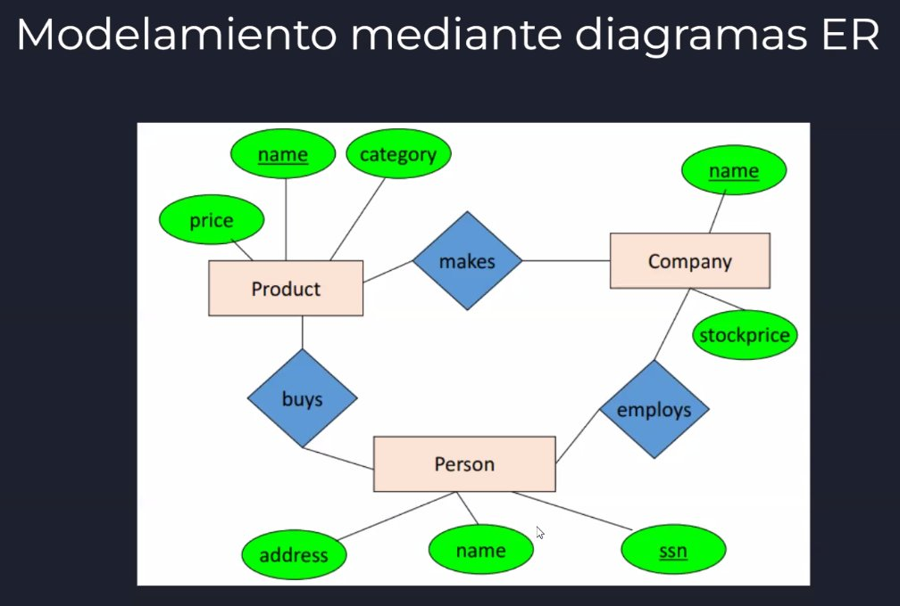
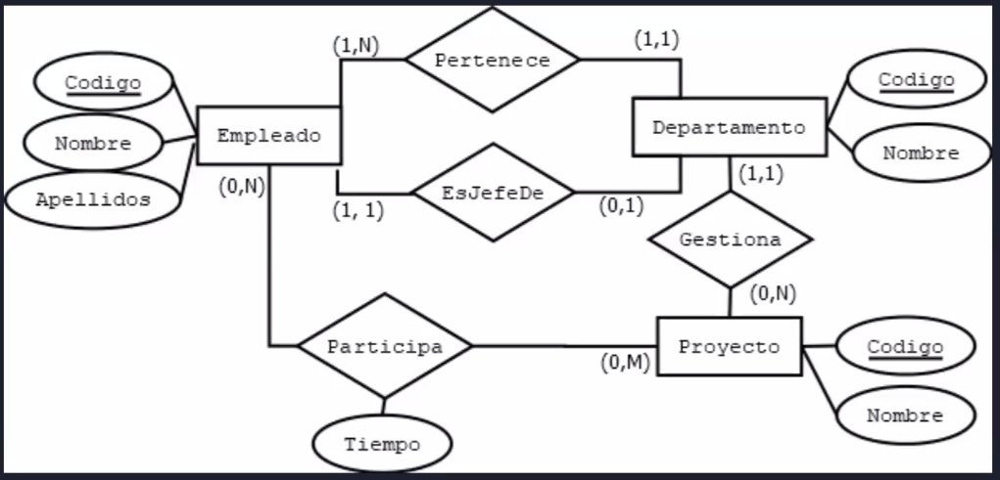

# Modelamiento

Las cardinalidades de las relaciones se leen siempre al final de la flecha de relación. En el ejemplo de arriba un empleado puede participar de 0 a M proyectos y un proyecto puede tener 0 a N empleados.
