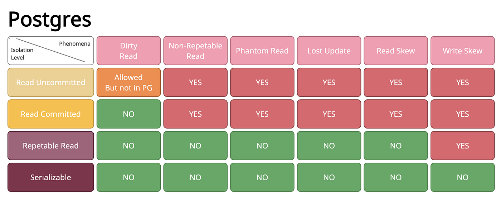

# Transacciones

Motivaciones:
* Operaciones conflictivas.
* Acceso a tuplas compartidas.
* Reportes sobre bases de datos transaccionales.
* Blue screen of death.

## ACID
* **Atomicity:** Todo o nada.
* **Consistency:** Respetar las reestricciones de consistencia de datos.
* **Isolation:** Cada transacción debe ejecutarse en un ambiente aislado.
* **Durability:** Una vez la transacción se ha completado, su efecto debe quedar persistido.

## Contras de las transacciones
* Locking data may cause deadlocks.
* Degrada el performance.

## Niveles de aislamiento

El serializable detiene las otras operaciones que necesitan la misma tupla.

* Dirty Read: Leer data que no ha sido comiteada por otra transacción.
* Non-repeatable reads: Las lecturas dentro de la transacción no son consistentes.
* Phantoms: Nuevas tuplas que aparecen o desaparecen.
