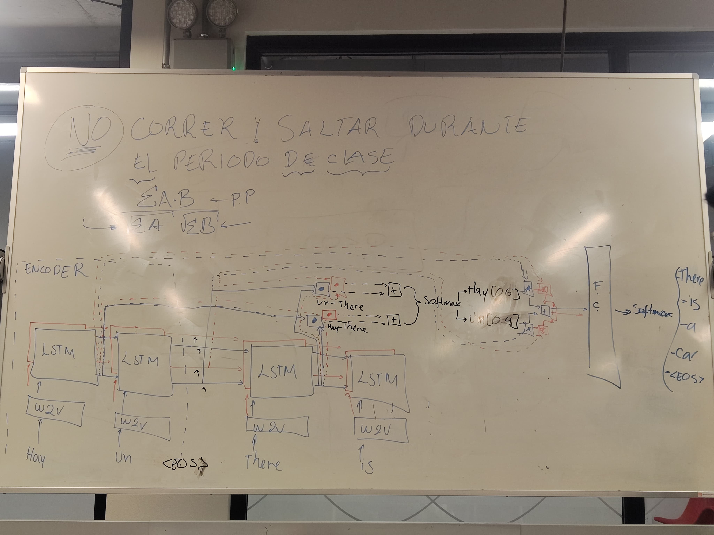

# Attention

Las redes neuronales tratan las entradas normalmente como iguales. La atención
es un mecanismo para decirle a una red neuronal a qué le debe dar mayor peso
dentro del input.

Se sigue la misma estructura en general del Encoder/Decoder, pero este agrega
una comparación entre cada palabra de input/output. La comparación la da la
siguiente fórmula:

(Si se tienen m palabras de input y n palabras de output)

$$
\frac{\sum A\cdot B}{\sqrt{\sum A}\sqrt{\sum B}}
$$

(Si en su lugar se tiene m palabras de input y m de output)

$$
\sum A\cdot B
$$

## Self-Attention

Se refiere a establecer relaciones diferentes entre palabras de la misma
oración. Se utiliza la misma estructura de arriba pero con la misma oración de
entrada y salida.
