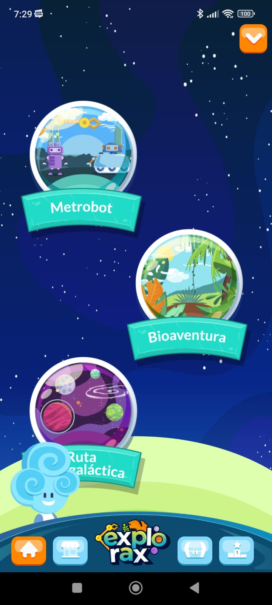

# Observaciones

- En las animaciones de las pantallas antes del Login hay texto que hace que lo
  demás de la pantalla se corra.
- El botón de logout no tiene un ícono intuitivo para el logout.
- En mi pantalla los mundos deberían de salir más arriba porque Chanin es muy
  cabezón. 
- Mi progreso en la ruta intergaláctica aparece completado al 50% cuando no he
  hecho nada.
- Se podría cambiar la música al momento de hacer el cuestionario para hacerlo
  más dinámico/tenso. Nos podríamos inspirar de Kahoot por ejemplo que
  dependiendo de la pregunta a veces cambia la música.
- Las instrucciones del escenario de la escoba y rocas no están muy claras, no
  sabía qué opción seleccionar. Intenté seleccionar "Efectuar la resta de las
  unidades" y cuando le dí "verificar" me sale UPS.\* El reloj se quedó
  congelado también. 
- Ups tiene una exis pero no se puede cerrar.
- Seleccionar la opción en el telescopio no es muy intuitivo y no guarda tu
  posición.
