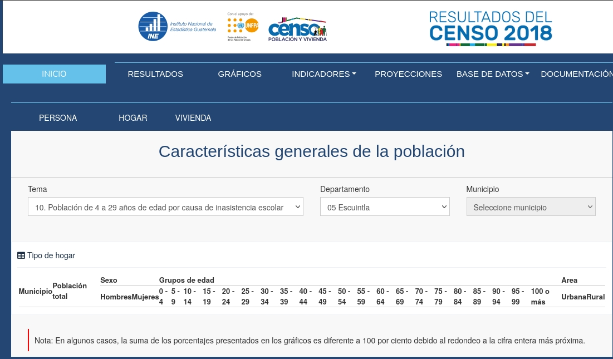
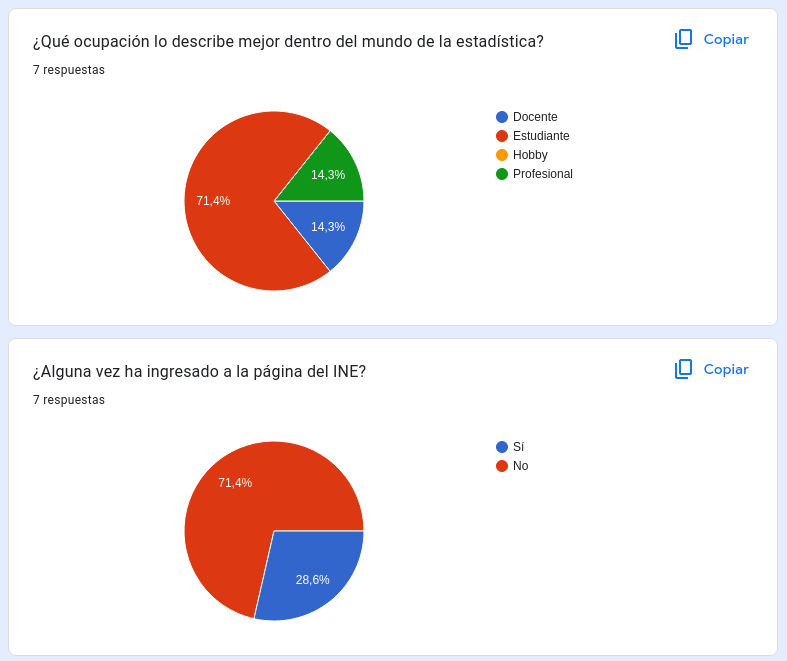

# Investigación

Investigando para un tema de proyecto aparte me topé con que la página del INE es mala para mostrar información y hay secciones que directamente no funcionan como lo son la sección de Gráficos de la página web:

Para la investigación se decidió principalmente entrevistar a las personas dentro de la comunidad UVG acerca del tema y para qué utilizan la página del INE.

