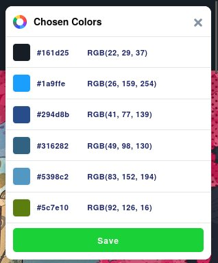
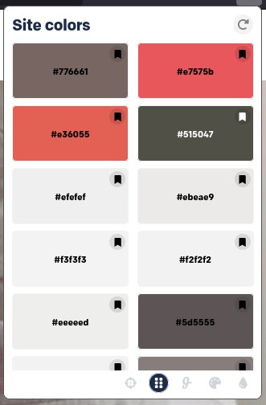

# Semana 1

El 74% de las madres estadounidenses juegan videojuegos. De las cuales el 38% lo hacen diariamente. El medio principal por el que juegan es el dispositivo móvil ya que el 65% de las madres que juegan lo utilizan para jugar.

[Fuente](https://www.abc.es/tecnologia/videojuegos/20130827/abci-madres-eeuu-juegan-videojuegos-201308271925.html#)

## Persona Mamá

### Zuzy

Es una mamá de una familia de 2 pequeños y su esposo, le gusta jugar videojuegos varias veces por semana generalmente para conectar con sus hijos preadolescentes, debido a esto utiliza predominantemente consolas y computadoras para jugar aunque a veces juega más que uno u otro juego en su teléfono. Le gustan juegos relajantes y sencillos, aunque intenta jugar lo que les gusta a sus hijos para conectar con ellos.

## Steam
Fue creado en 2003 por VALVe con el objetivo de ser un canal de distribución de contenido digital, Steam se creo antes de las _app stores_ y ha crecido hasta el monstruo _monopolio_ que es hoy en el ámbito de las computadoras. [Fuente](https://www.valvesoftware.com/about)

En el 2020 tuvieron 120 millones de usuarios activos mensuales de los cuales:
- 37% se encuentran entre 20-29 años de edad.
- 32% se encuentran entre 30-39 años de edad.
- 15% se encuentran entre 40-49 años de edad.
- 8% se encuentran entre 18-19 años de edad.

El 31% de los usuarios de steam son mujeres mientras que el 69% son hombres.
[Fuente](https://sidetrain.com/guides/steam-user-demographic-statistics)

Como se puede ver, las mamás en sí no son un grupo demográfico particularmente alto dentro de la plataforma de steam, ya que aún dentro de las mujeres que representan el 31% de la población, el promedio de edad para el primer hijo entre las mujeres en estados unidos es de 27.3 años.
[Fuente](https://www.pewresearch.org/short-reads/2023/05/09/facts-about-u-s-mothers/)

## Paleta de Colores - Steam

La paleta de colores de Steam tiende a ser oscura con tintes de azules de distintos tonos y el ocasional verde. Es una paleta de colores que evoca confianza y honestidad mientras que el tono oscuro muestra poder y elegancia.

## Paletas de Colores Websites de mamás

[Mamis digitales](https://mamisdigitales.org/)

[Una mami que se mima](http://www.unamamiquesemima.com/)
- \#f2bbc7
- \#f7f7f7
- \#158698

La mayoría de los sitios que encontré que estaban dirigidos a madres usaban colores claros combinados con rosas y morados de distintas tonalidades, a veces se ponían un poco más atrevidos y utilizanan marrón pero en general se centraban en tema claro con colores claros.
