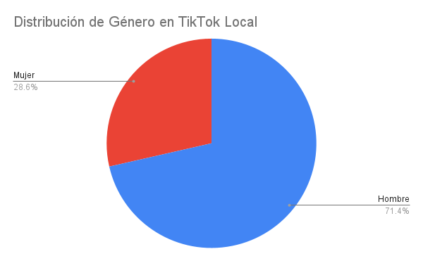

# Entendiendo a TikTok como aplicación
Algunas de las características que tiene TikTok son:

## Features
- Video Uploading
- Live Video Streaming
- Video Editing
- Filters and Effects
- Social Sharing 
- Likes and Comments
- Notifications
- Duets: Permite a las personas subir un video en respuesta a otro video con algunas configuraciones y ediciones iniciales por defecto que facilitan la reacción al contenido.
- Reactions
- Hashtags
- QR Code Scanner: Permite a personas suscribirse a creadores usando simplemente un código QR.
- Geolocation: Para mostrar videos de personas que viven cerca de tí.
- Real-Time Analytics
- Video Preview (before signing up)

## ¿Quién usa TikTok?

[Fuente](https://www.doofinder.com/es/blog/estadisticas-tiktok)
[Fuente](https://www.primeweb.com.mx/tiktok-estadisticas)

- **¿Cuántos usuarios tiene TikTok en total?**
TikTok tiene un total de 1,218 millones de usuarios.

- **¿Cuál es la distribución de las edades de los usuarios de TikTok?**

- **¿Cuál es la distribución de los géneros de los usuarios de TikTok?**
El 49.2% de los usuarios globales son mujeres mientras que el 50.8% son hombres.

- **¿Cuál es la distribución de los niveles de educación de los usuarios de TikTok?**

- **¿Qué porcentaje de los usuarios usa TikTok todos los días?**
Aproximadamente el 70% de los usuarios utilizan TikTok más de una hora al día.

- **¿Cuántas horas al día usa TikTok un usuario promedio?**
Un usuario promedio utiliza TikTok 23.6hrs al mes.

- **¿Cuándo tiempo dura una sesión de uso promedio?**
Una sesión de uso proedio de TikTok se encuentra entre 30 y 60 minutos.

- **¿Cómo se compara TikTok con las otras redes sociales populares en cuanto a total de usuarios?**

# Usuarios
Sobe la data que se recolectó se tiene:

## ¿Consideran que su data es representativa de la totalidad de usuarios?
No la considero representativa, pues hay varios cesgos que no se tomaron en cuenta al momento de responder la encuesta y se demuestran en la data en sí, por ejemplo:
- La carrera de computación es mayoritariamente compuesta por estudiantes masculinos, por lo que las respuestas de género en general tendrán más encuestados hombres que mujeres.
- Debido a que nuestra carrera es una licenciatura, la mayoría de estudiantes se encuentran entre 18 y 21 años, por lo que los rangos de edad de 30+ años ni si quiera aparecen en las gráficas de edades.
- Algunos cesgos extras que se dan son la localidad de los encuestados, ya que todos vivimos relativamente cerca unos de otros que los usuarios de TikTok que son globales.

Debido a que los cesgos no fueron correctamente considerados al momento de realizar la encuesta, de entrada no la consideraría una muestra representativa, y los datos respaldan esta conclusión al momento de graficar.

## Analizando la Data

- **¿Qué porcentaje de usuarios dijo que TikTok era una de sus top 3 aplicaciones?**

66.7% de la muestra respondió que TikTok se encontraba en su top 3 de aplicaciones.
- **¿Qué porcentaje de los usuarios dijo que utilizaba TikTok todos los días?**

3 personas de 21 contestaron que usaban TikTok todos los días, siendo esto un porcentaje del 14.29%.

A continuación se muestra una TagCloud de los adjetivos utilizados para describir la red social:

- **¿Cuales fueron los 3 adjetivos más utilizados?**
Entretenido y Divertido son el top 2 adjetivos más utilizados, mientras que el tercero es un empate entre varios adjetivos: adictivo, creativo, informativo, interesante. 

- **¿Consideran que el diseño de la aplicación de TikTok se siente como los diseñadores originales planificaron?**
Me parece que la data es clara en que su visión la cumplieron, ya que las plataformas sociales arriba de TikTok en usuarios son plataformas que tienen objetivos distintos a ellos en el sentido de el manejo de videos y contenido, como facebook y twitter. Además, uno de los objetivos que tiene listado TikTok en su misión y visión es brindar entretenimiento, lo cual diría yo lo cumplieron ya que es una de las palabras que fue el top 2 de adjetivos.
