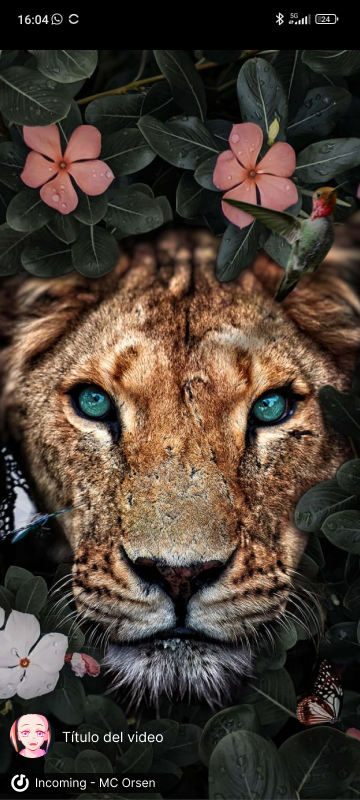
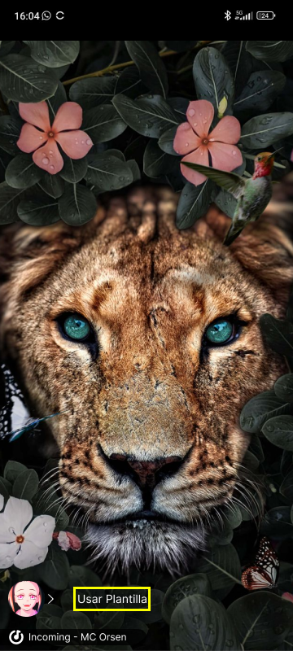

# Rediseño de aplicación

Para entender un poco el rediseño y qué se cambió, recordemos el diseño original de TikTok.

Como se puede ver TikTok en sí tiene un varios botones en la pantalla principal, sin embargo a pesar de tener estos botones se tiene formas alternativas de realizar las mismas acciones a las que estos dan acceso, como por ejemplo el ver el perfil del creador de contenido, ya que se puede ver presionando el botón o deslizando hacia la izquierda.

Mi rediseño busca reducir la complejidad de la pantalla principal para solamente enforcarse en el contenido:

El título del video aparecerá de forma temporal en el video para luego desaparecer y liberar todavía más espacio dentro de la pantalla.

Cuando se esconda el título del video se muestra un botón que es una ">" esto permite desplegar el título de nuevo por una cierta cantidad de segundos.

Algunos TikToks son realizados con plantillas, en ese caso luego de esconderse el título del video se mostrará el botón para crear un Tiktok con la misma plantilla:

La principal forma de navegación dentro de esta plataforma es el deslizar el dedo hacia la derecha o izquierda. Dependiendo de si tu cuenta es creadora de contenido o no las pestañas serán las siguientes:
- **Cuenta audiencia:** Comentarios | Recomendados | Seguidos | Perfil
- **Cuenta creador de contenido:**
    - **Navega al Perfil**: Crear Contenido | Principal | Seguidos | Perfil
    - **Navega desde el Perfil:** Crear Contenido | Comentarios | Recomendados | Seguidos | Perfil

Para las cuentas de creadores de contenido la pantalla comentarios solamente aparece cuando se estuvo en la pantalla de recomendados previamente.

Por último, la primera vez que se inicie la aplicación se le preguntará al usuario si es derecho o izquierdo, dependiendo de su respuesta el botón de usuario estará a la izquierda como en las pantallas de arriba o a la derecha:

## FAQ
- **¿Cómo se le da like al TikTok?**

Como muchas redes sociales actualmente, puedes darle doble tap a la pantalla para darle like o corazón al TikTok.

- **¿Cómo veo los comentarios, comparto o guardo el TikTok?**

Para leer los comentarios, compartir el video y guardarlo dentro de alguna lista de reproducción puedes simplemente deslizar hacia la derecha, lo cual abrirá el popup de comentarios en donde además, podrás compartir o guardar el video en alguna playlist.

- **¿Qué sucede con mi pestaña de "Seguidos"? ¿Cómo creo contenido?**

Si tu cuenta es creadora de contenido puedes deslizar hacia la izquierda para abrir la pantalla de creación de contenido, mientras que si eres una cuenta común y corriente deslizar a la izquierda te revelará tu pestaña de seguidos.

- **¿Cómo veo mi perfil? ¿Cómo veo mis amigos?**

Tus notificaciones, perfil y amigos se encuentran en dos pestañas más a la derecha, simplemente sigue deslizando hacia la izquierda.

## ¿Por qué este rediseño?
TikTok actualmente es una empresa que domina el mercado de videos (particularmente los cortos), la mayoría de los usuarios que utilizan TikTok superaron la secundaria o más títulos además de que el 57.1% de sus usuarios son menores a 25 años. Todo esto nos dice que la mayoría de los usuarios de TikTok no son solamente jóvenes sino que también son gente que ha recibido una educación formal.

Mi rediseño no busca hacer la interfaz más intuitiva para usuarios nuevos a las redes sociales en internet, sino que busca mejorar la experiencia de usuario para el usuario mayoritario de TikTok, un jóven experimentado con las redes sociales al que le gustaría poder ver sus videos y no ser inundado con una pantalla llena de no solo botones sino que además acciones redudantes.
