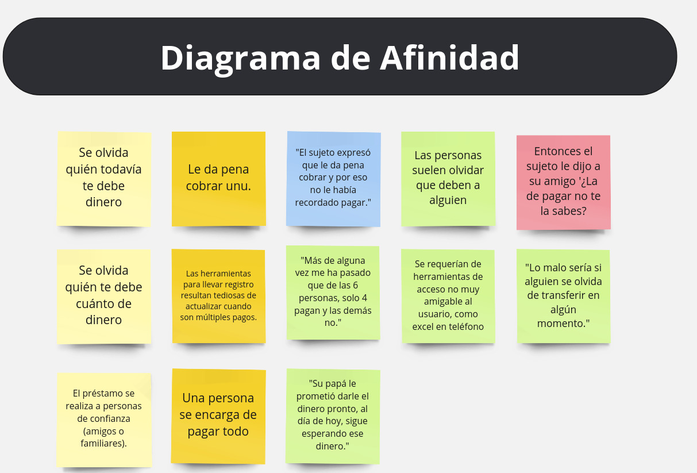
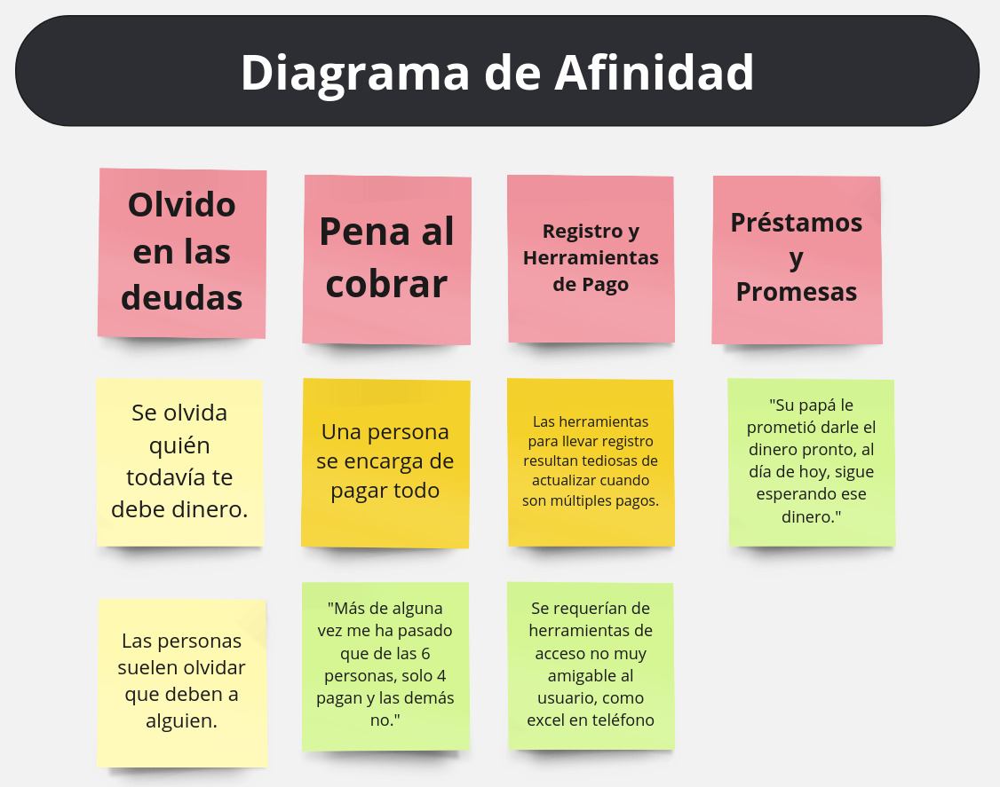
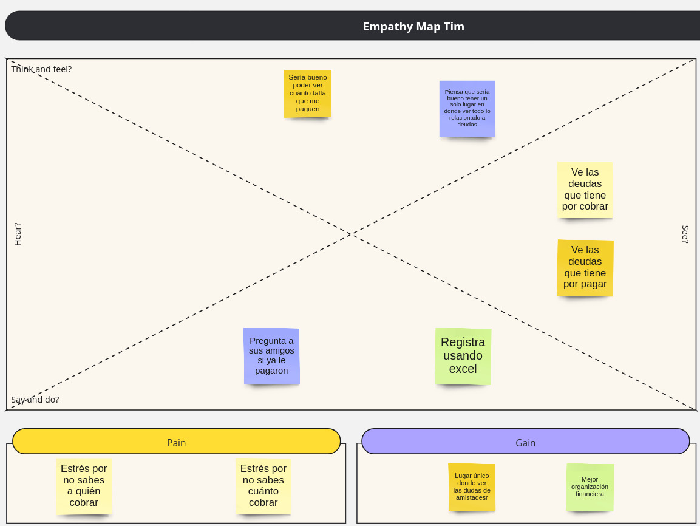

# Semana 1
Diagrama de Afinidad Antes:

Diagrama de Afinidad Después:

## Definición del Problema
Este proyecto de resideño "WhatsApp Pay" busca resolver el desorden en el control de las finanzas que se llevan a cabo de forma informal por medio de chats dentro de la aplicación. Esto incrementará la fidelidad de usuarios pues les proveeremos un servicio de calidad para organizarse con sus deudas desde negocios pequeños hasta reuniones informales entre amigos.

### Problem Statement
El proyecto WhatsApp Pay integra un sistema de organización de finanzas informales para micro empresas o grupos de amigos que les permita fácilmente registrar pagos y deudas entre contactos. Esto aumentará los casos de uso de WhatsApp dentro de la vida de nuestros usuarios.

### Objetivos
* Integrar un sistema de finanzas con WhatsApp:
    * Permite registrar deudas.
    * Permite registrar cobros parciales/totales.

## Mapas de Empatía
### Tim

**Edad:** 30 años

Tim es un amigo muy responsable, casi siempre se ofrece para pagar la cuenta cuando sale con sus amigos y absorber la deuda sea le paguen o no.

Tim se preocupa por llevar la cuenta de todos los pagos que ha recibido de sus amigos. También le gustaría poder ver fácilmente quién le debe, cuánto y por qué.

**Edad:** 25 años

Kim es una mujer emprendedora que utiliza App WhatsApp Business para interactuar con sus clientes.

Kim se preocupa por registrar las cuentas de sus clientes, al igual que tim se preocupa por llevar la cuenta de todos los pagos que ha recibido pero en lugar de sus amigos es con sus clientes.
