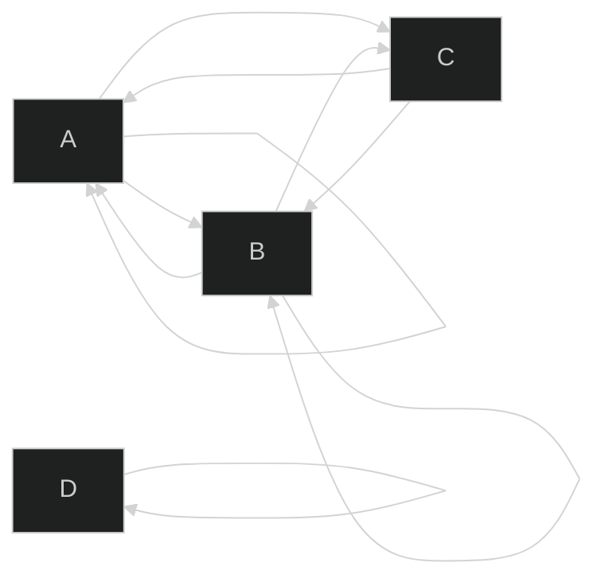

# Relación de Equivalencia
Cumple reflectividad, simetría y transitividad. Las equivalencias inducen particiones de conjuntos. Cada uno de estos conjuntos particiones se llaman clases de equivalencia.

Una **partición** de un conjunto se da cuando se cumple:
* $A_{subconjunto}\cup A_{subconjunto} = A$
* $A_{subconjunto}\cap A_{subconjunto} = \empty$
* $A_i\neq\empty\ para\ todo\ i$

## Ejemplo

La matriz de adyancencia sería:
$$
M_a=\begin{vmatrix}
 &a &b &c &d\\
a &1 &1 &1 &0\\
b &1 &1 &1 &0\\
c &1 &1 &0 &0\\
d &0 &0 &0 &1\\
\end{vmatrix}
$$

Las propiedades de esta matriz son entonces:

**Reflexividad**

Toda la diagonal es 1, por lo tanto sí es reflexiva.

**Simetría**

Si calculamos la transpuesta entonces:
$$
M_a^T=\begin{vmatrix}
 &a &b &c &d\\
a &1 &1 &1 &0\\
b &1 &1 &1 &0\\
c &1 &1 &0 &0\\
d &0 &0 &0 &1\\
\end{vmatrix}
$$

Por lo que sí son simétricas.

**Antisimetría**

Al multiplicar la transpuesta con la matriz original y compararla con la identidad se puede ver que tiene 1's de más, por lo que no es antisimétrica.

**Transitividad**

No es transitiva, pues aunque se tiene (c,a) y (a, c) no se tiene (c,c).

---
Sea $A=\{x\in Z^+|0\leq x\leq9\}$ y $R$ una relación de equivalencia sobre $A$ tal que:
$$
R=\{(a,b)|a-b=3k,k\in Z\}
$$

a) Liste los elementos del conjunto $[0]$.
$$
[0]=\{0,3,6,9\}
$$

b) Determine si $2\in[7]$.
$$
7-2=5\ne3k\rightarrow2\notin[7]
$$

c) ¿Cuál es la partición inducida por R sobre A?
$$
\{\{0,3,6,9\}, \{1,4,7\}, \{2,5,8\}\} 
$$

# Relación de Orden
Cuando dos objetos son comparables, es porque $(a,b)\in R$ en donde $R$ es el conjunto en que el está definia la relación.

Las relaciones de Orden parcial inducen una jerarquía en dicho conjunto.

Es una relación que es reflexiva, transitiva y antisimétrica. Debido a estas suposiciones, se puede simplificar el diagrama de grafo, quitando líneas y flechas. Este nuevo diagrama se le llama [[Diagrama de Hasse]]
![[Diagrama de Hasse.png]]

Si para todo par de elementos de $A$ se cumple $a \leq b$ o $b \leq a$ entonces decimos que la relación es un orden total o lineal (Pues el diagrama de Hasse de una relación de orden lineal es una línea). 

**Cotas superiores e inferiores**

Dado un Partially Ordered Set $(A,R)$ y $B\subset A$ decimos que:
* $u\in A$ es una cota superior de $B$ si $b\preccurlyeq u$ para todo $b\in B$.
* $l\in A$ es una cota inferior de $B$ si $l\preccurlyeq b$ para todo $b\in B$.

**Supremo e Ínfimo**

Tanto el supremo como el ínfimo pueden o no estar dentro del conjunto que se analiza.

El supremo es la cota superior más pequeña.

La ínfima es la cota inferior más grande.

**Máximos y Mínimos**

Pueden o no existir.

El máximo de un set ordenado es el que se encuentra hasta arriba del diagrama de Hasse, es decir, el más grande según la relación.

El mínimo de un set ordenado es el que se encuentra hasta abajo del diagrama de Hasse, es decir, el más pequeño según la relación.
