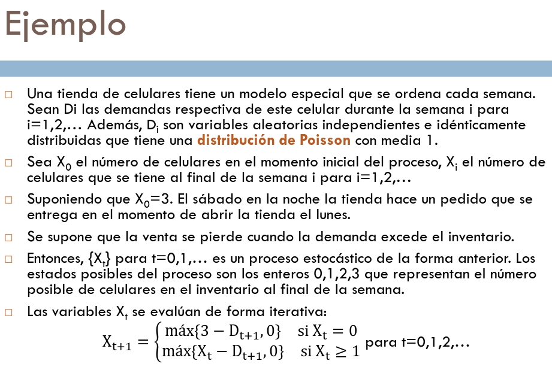

## Proceso Estocástico
Una familia de variables aleatorias $\{X_t\}$ donde $t$ es un punto en un espacio $T$, llamado espacio parametral, y donde para cada $t$, $X_t$ es un punto $S$ llamado espacio de estados, es un proceso ecstocástico.

## Proceso de Markov
Es un proceso estocástico donde, dado el valor de $X_t$ los valores de $X_s$ para $t\lt s$ no dependen de los valores de $X_u$ para $u\lt t$. Esto quiere decir que para calcular el valor de la siguiente variable aleatoria solamente necesito saber el valor de la actual.

Entonces en probabilidades:

## Cadenas de Markov
Es un espacio de Markov que tiene un espacio de estados finito o contable es llamado una cadena de Markov.

Para obtener la probabilidad de que el estado siguiente sea $j$ dado que nos encontramos en el estado $i$ se usa:
$$
P_{i^nj^{n+1}}=P([X_{n+1}=j]|[X_n=i])
$$

## Matriz de Transición
Es una forma simplificada de representar las transiciones entre los valores de las cadenas de Markov.

## Distribución de Estados Iniciales
Se obtiene al multiplicar el vector de estados iniciales por la matriz de transición en la cantidad de pasos deseados.

## Clasificación de Estados
* Accesible: Si la probabilidad de transición es mayor a 0.
* Comunicados: Dos estados son comunicados si son accesibles mutuamente.
* Irreducible: Si todos los estados pueden accederse entre sí se dice que es irreducible.
* Cerrado: Un conjunto C de estados es cerrado si no se puede llegar a ningún estado que no esté en C.
* Absorbente: Un estado absorbente es aquel en el que una vez se entra a él no se puede salir.
* Transitorio: Se le llama al estado en el que una vez se entra en él no se puede regresar a él.
* Recurrente: Se le llama al estado que no es transitorio.
* Ergódicos: Son los estados en una cadena de Markov de estados finita que sean recurrentes y aperiódicos.

![Estados estables](./imgs/estados-estables.jpg]

## Periodicidad
Un período se denota como el máximo común divisor de todos los $n\ge1$ para los cuales $P_{i^ni}\gt0$

De todas las probabilidades con probabilidad positiva para regresar al mismo estado se toma el máximo común divisor.

Una cadena de Markov en la cual cada estado tiene período 1 es aperiódica.
